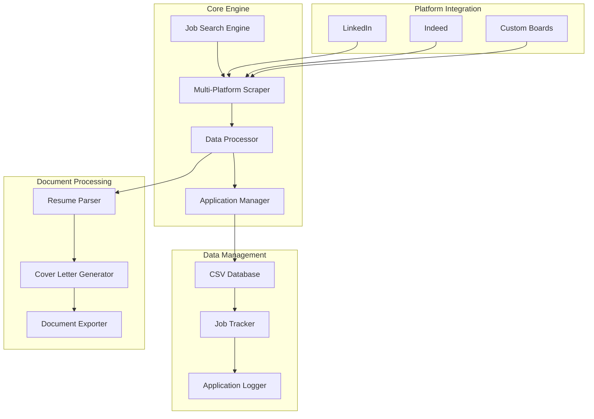
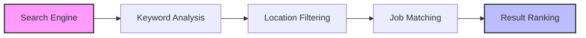
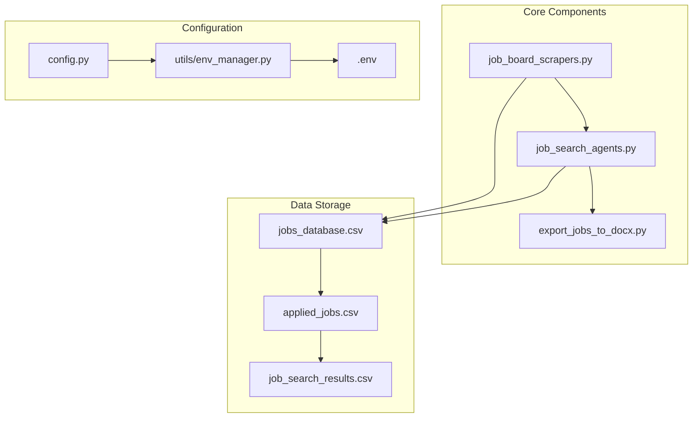
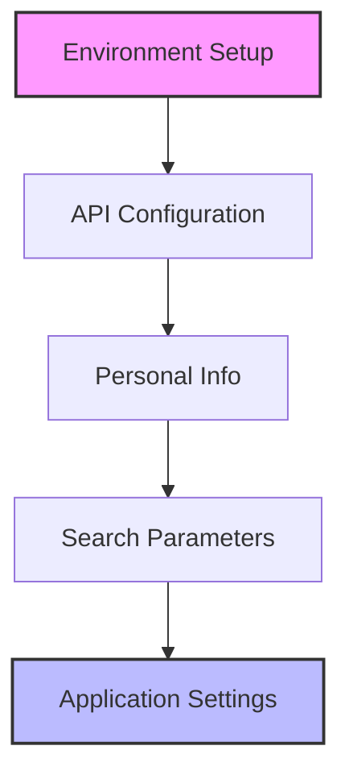
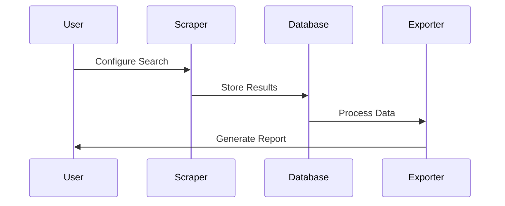
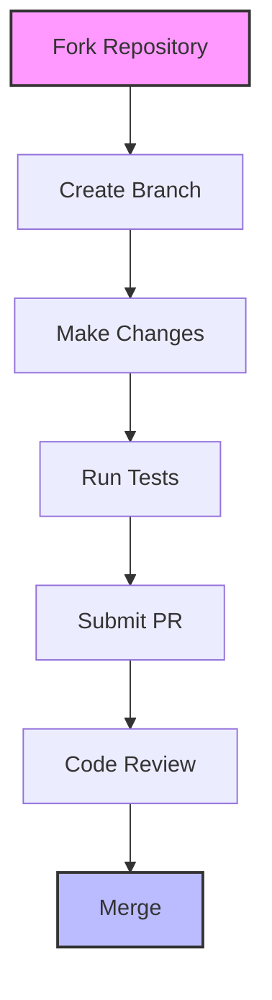

# 🚀 Advanced Job Search Automation Framework

<div align="center">

[](https://www.python.org/downloads/)
[](LICENSE)
[]()
[](https://github.com/psf/black)
[]()

*A sophisticated, AI-powered framework for intelligent job search automation and application management*

</div>

## 📊 System Architecture



## 🌟 Implemented Features

### 🔍 Intelligent Job Search


- Multi-platform job scraping (LinkedIn, Indeed)
- Advanced keyword matching
- Location-based filtering
- Custom search parameters
- Result ranking and prioritization

### 📊 Data Management
- CSV-based job database
- Application tracking system
- Search result logging
- Export to DOCX format
- Custom data filtering

### 🔒 Security Implementation
- Environment-based configuration
- Secure API key management
- Headless browser operation
- Rate limiting and throttling
- Proxy support

## 🛠 Technical Implementation



## 🚀 Getting Started

### Prerequisites
- Python 3.8+
- Chrome/Chromium browser
- Virtual environment support

### Installation

```bash
# Clone the repository
git clone https://github.com/yourusername/job-search-automation.git
cd job-search-automation

# Create and activate virtual environment
python -m venv .venv
source .venv/bin/activate  # Linux/Mac
.venv\Scripts\activate     # Windows

# Install dependencies
pip install -r requirements.txt

# Set up environment variables
cp .env.template .env
# Edit .env with your configuration
```

### Configuration



## 💡 Advanced Usage

### Job Search Configuration
```python
from job_search_agents import JobSearchAgent

agent = JobSearchAgent(
    keywords=["Python", "Machine Learning"],
    locations=["Remote", "New York"],
    max_results=50
)

# Start search
results = agent.search_jobs()
```

### Document Export
```python
from export_jobs_to_docx import JobExporter

exporter = JobExporter("jobs_database.csv")
exporter.export_to_docx(
    output_path="job_search_results.docx",
    filter_criteria={"status": "new"}
)
```

## 📊 Data Flow



## 🔐 Security Features

- **Data Protection**
  - Environment variable management
  - Secure credential storage
  - Local data encryption

- **Privacy Controls**
  - Headless browser operation
  - Minimal data collection
  - Configurable logging

## 🤝 Contributing

We welcome contributions! Please see our [Contributing Guidelines](CONTRIBUTING.md) for details.

### Development Workflow



## 📈 Roadmap

- [ ] Advanced AI job matching
- [ ] Multi-language support
- [ ] Real-time job alerts
- [ ] Interview preparation tools
- [ ] Enhanced analytics dashboard

## 📚 Documentation

- [API Reference](docs/api.md)
- [Architecture Guide](docs/architecture.md)
- [Security Guide](docs/security.md)
- [Contributing Guide](docs/contributing.md)

## 🏆 Acknowledgments

- [Selenium](https://www.selenium.dev/) - Web automation
- [BeautifulSoup4](https://www.crummy.com/software/BeautifulSoup/) - Web scraping
- [Pandas](https://pandas.pydata.org/) - Data processing
- [python-docx](https://python-docx.readthedocs.io/) - Document generation

## 📄 License

This project is licensed under the MIT License - see the [LICENSE](LICENSE) file for details.

---

<div align="center">
  <h3>Thank You</h3>
  <p>Built with ❤️ by the Job Search Automation Team</p>
</div> 