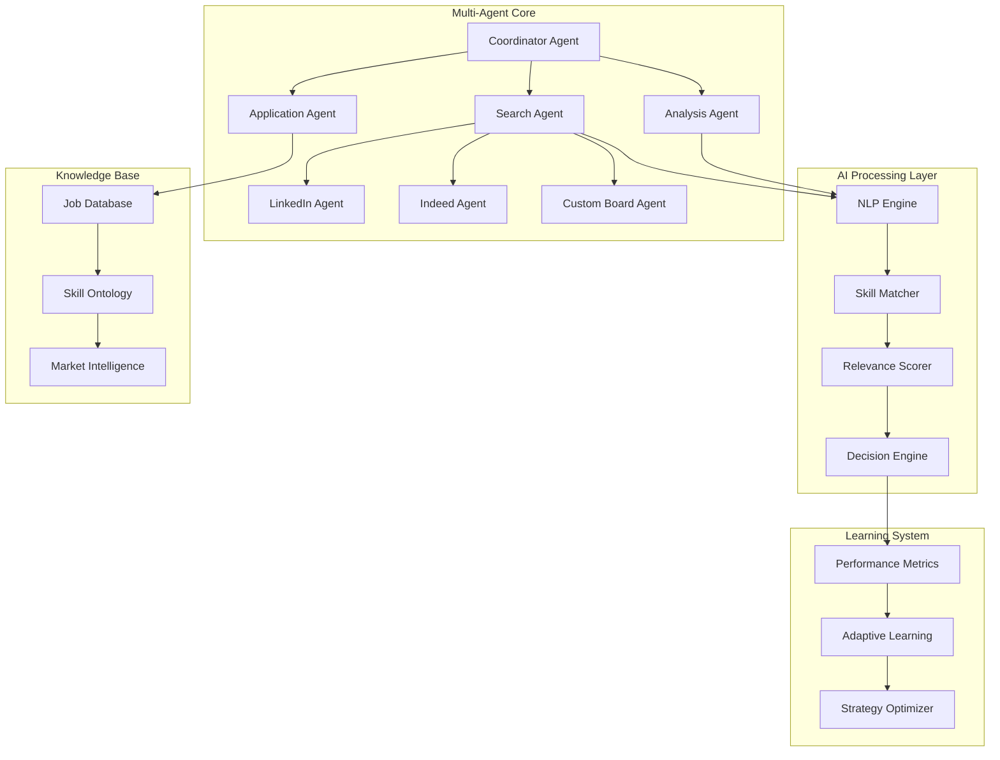
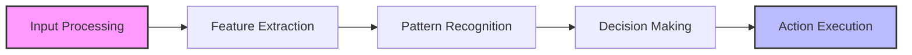
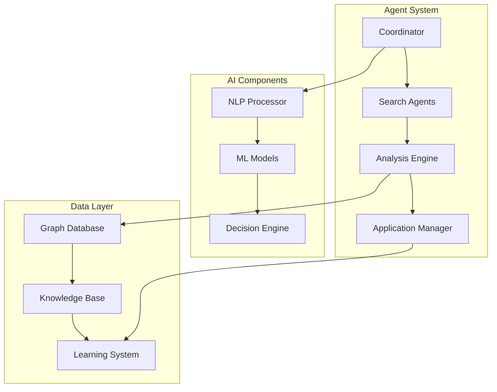
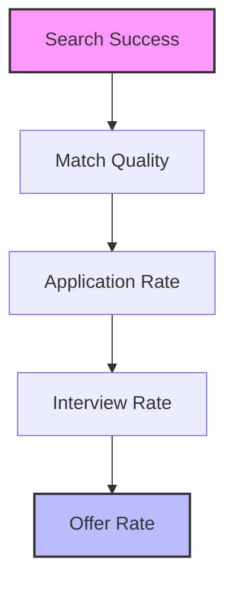

# 🤖 Multi-Agent Job Search Automation Framework

<div align="center">

[](https://www.python.org/downloads/)
[](LICENSE)
[]()
[](https://github.com/psf/black)
[]()
[]()

*A sophisticated Multi-Agent System (MAS) framework for intelligent job search automation and application management, leveraging advanced AI techniques*

</div>

## 📊 System Architecture



## 🌟 Advanced Features

### 🤖 Multi-Agent Coordination
- Distributed task allocation
- Inter-agent communication protocols
- Dynamic role assignment
- Conflict resolution mechanisms
- Collective decision making

### 🧠 AI-Powered Analysis


- Natural Language Processing for job description analysis
- Machine Learning-based skill matching
- Neural network for relevance scoring
- Reinforcement learning for strategy optimization
- Transfer learning for cross-platform adaptation

### 📊 Intelligent Data Management
- Graph-based knowledge representation
- Ontology-driven skill matching
- Temporal data analysis
- Market trend prediction
- Adaptive filtering systems

## 🛠 Technical Implementation



## 🚀 Getting Started

### Prerequisites
- Python 3.8+
- Chrome/Chromium browser
- Virtual environment support
- CUDA support (optional, for GPU acceleration)

### Installation

```bash
# Clone the repository
git clone https://github.com/SaurabMishra12/MAS_towards_AGI.git
cd MAS_towards_AGI

# Create and activate virtual environment
python -m venv .venv
source .venv/bin/activate  # Linux/Mac
.venv\Scripts\activate     # Windows

# Install dependencies
pip install -r requirements.txt

# Set up environment variables
cp .env.template .env
# Edit .env with your configuration
```

## 💡 Advanced Usage

### Multi-Agent Configuration
```python
from job_search_agents import AgentCoordinator

coordinator = AgentCoordinator(
    search_agents=['linkedin', 'indeed'],
    analysis_agents=['nlp', 'ml'],
    application_agents=['auto', 'manual']
)

# Start coordinated search
results = coordinator.execute_search(
    strategy='adaptive',
    learning_rate=0.01,
    exploration_rate=0.2
)
```

### AI Model Integration
```python
from ai_engine import JobAnalyzer

analyzer = JobAnalyzer(
    model_type='transformer',
    pretrained_model='job-bert',
    fine_tune=True
)

analysis = analyzer.process_job(
    job_description="...",
    candidate_profile="...",
    market_context="..."
)
```

## 📊 System Performance



## 🔬 Research Components

- **Multi-Agent Learning**
  - Cooperative learning algorithms
  - Distributed optimization
  - Emergent behavior analysis
  - Agent communication protocols

- **AI Models**
  - Transformer-based job analysis
  - Graph neural networks for skill matching
  - Reinforcement learning for strategy optimization
  - Transfer learning across platforms

## 📈 Future Research Directions

- [ ] Advanced multi-agent coordination protocols
- [ ] Cross-platform transfer learning
- [ ] Dynamic strategy adaptation
- [ ] Emergent behavior analysis
- [ ] Quantum-inspired optimization

## 📚 Documentation

- [Architecture Guide](docs/architecture.md)
- [Agent System Design](docs/agents.md)
- [AI Models](docs/ai_models.md)
- [Research Methodology](docs/research.md)

## 🏆 Acknowledgments

- [Selenium](https://www.selenium.dev/) - Web automation
- [BeautifulSoup4](https://www.crummy.com/software/BeautifulSoup/) - Web scraping
- [PyTorch](https://pytorch.org/) - Deep learning
- [NetworkX](https://networkx.org/) - Graph analysis
- [Hugging Face](https://huggingface.co/) - NLP models

## 📄 License

This project is licensed under the MIT License - see the [LICENSE](LICENSE) file for details.

---

<div align="center">
  <h3>Thank You</h3>
  <p>Built with ❤️ by Saurab Mishra</p>
  <p>Data Science | Machine Learning | AI | NLP | Multi-agent Systems</p>
</div> 